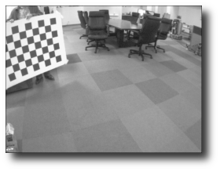
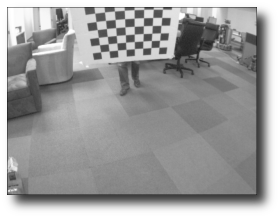
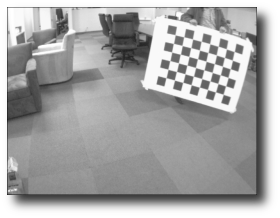
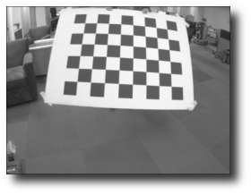

Tutorial: Monocular Calibration
===============================

This tutorial cover using the ``cameracalibrator`` node to calibrate
a monocular camera with a raw image over ROS 2.

Before Starting
---------------
Make sure that you have the following:

 * A large checkerboard with known dimensions. This tutorial uses a 8x6
   checkerboard with 108mm squares. Calibration uses the interior vertex
   points of the checkerboard, so an "9x7" board uses the interior vertex
   parameter "8x6" as in the example below.
 * A well lit 5m x 5m area clear of obstructions and check board patterns
   a monocular camera publishing images over ROS.
 * Install ROS 2 and the ``camera_calibration`` package.

Finally make sure your camera is publishing images. For instance:

.. code-block:: bash

    $ ros2 topic list | grep camera

    /camera/camera_info
    /camera/image_raw

If you have multiple cameras or are running the driver in its own
namespace, your topic names may differ.

Running the Calibration Node
----------------------------
To start the calibration you will need to load the image topics that
will be calibrated:

.. code-block:: bash

    ros2 run camera_calibration cameracalibrator --size 8x6 --square 0.108 image:=/camera/image_raw camera:=/camera

This will open up the calibration window which will highlight the checkerboard:

.. figure:: images/mono_0.png
   :width: 90%
   :align: center

If it does not open up the window try the following parameter:

.. code-block:: bash

    --no-service-check

If you can't see any colored dots make sure you count the interior vertex points,
not the squares!

Dual Checkerboards
------------------
To use multiple checkerboards, give multiple ``--size`` and ``--square`` options
for additional boards. Make sure the boards have different dimensions, so the
calibration system can tell them apart.

Moving the Checkerboard
-----------------------
In order to get a good calibration you will need to move the checkerboard around
in the camera frame such that:

 * checkerboard on the camera's left, right, top and bottom of field of view

   * X bar - left/right in field of view
   * Y bar - top/bottom in field of view
   * Size bar - toward/away and tilt from the camera
 * checkerboard filling the whole field of view
 * checkerboard tilted to the left, right, top and bottom (Skew)

At each step, hold the checkerboard still until the image is highlighted in the
calibration window.

|cal0007| |cal0009| |cal0011|

|cal0006| |cal0008| |cal0012|

.. |cal0008| image:: images/cal0008.png
   :width: 32%

.. |cal0012| image:: images/cal0012.png
   :width: 32%

As you move the checkerboard around you will see three bars on the calibration
sidebar increase in length. When the **CALIBRATE** button lights, you have enough
data for calibration and can click **CALIBRATE** to see the results.

Calibration can take about a minute. The windows might be greyed out but just
wait, it is working.

.. figure:: images/mono_1.png
   :width: 90%
   :align: center

Calibration Results
-------------------
After the calibration is complete you will see the calibration results in the
terminal and the calibrated image in the calibration window:

.. figure:: images/mono_2.png
   :width: 90%
   :align: center

A successful calibration will result in real-world straight edges appearing
straight in the corrected image.

A failed calibration usually results in blank or unrecognizable images, or
images that do not preserve straight edges.

After a successful calibration, you can use the slider at the top of the
calibration window to change the size of the rectified image. A scale of
0.0 means that the image is sized so that all pixels in the rectified image
are valid. The rectified image has no border, but some pixels from the
original image are discarded. A scale of 1.0 means that all pixels in the
original image are visible, but the rectified image has black borders where
there are no input pixels in the original image.

.. code-block:: bash

    D =  [-0.33758562758914146, 0.11161239414304096, -0.00021819272592442094, -3.029195446330518e-05]
    K =  [430.21554970319971, 0.0, 306.6913434743704, 0.0, 430.53169252696676, 227.22480030078816, 0.0, 0.0, 1.0]
    R =  [1.0, 0.0, 0.0, 0.0, 1.0, 0.0, 0.0, 0.0, 1.0]
    P =  [1.0, 0.0, 0.0, 0.0, 0.0, 1.0, 0.0, 0.0, 0.0, 0.0, 1.0, 0.0]
    # oST version 5.0 parameters

    [image]

    width
    640

    height
    480

    [narrow_stereo/left]

    camera matrix
    430.215550 0.000000 306.691343
    0.000000 430.531693 227.224800
    0.000000 0.000000 1.000000

    distortion
    -0.337586 0.111612 -0.000218 -0.000030 0.0000

    rectification
    1.000000 0.000000 0.000000
    0.000000 1.000000 0.000000
    0.000000 0.000000 1.000000

    projection
    1.000000 0.000000 0.000000 0.000000
    0.000000 1.000000 0.000000 0.000000
    0.000000 0.000000 1.000000 0.000000

If you are satisfied with the calibration, click **COMMIT** to send the
calibration parameters to the camera for permanent storage. The GUI
exits and you should see "writing calibration data to ..." in the console.

Creating a YAML File
--------------------
The Camera Calibration Parser helps you to create a yml file, which you
can load with nearly all ros camera driver using the *camera_info_url*
parameter.

Rectifying an image
-------------------
Simply loading a calibration file does not rectify the image. For
rectification, use the ``image_proc`` package.
