Tutorial: Stereo Calibration
============================

This tutorial cover using the ``cameracalibrator`` node to calibrate
a stereo camera with a left and right image over ROS 2.

Before Starting
---------------
Make sure that you have the following:

 * A large checkerboard (8x6) or checkerboard (7x6) with known dimensions.
   This tutorial uses a 8x6 checkerboard with 108mm squares.
 * A well lit 5m x 5m area clear of obstructions and check board patterns
   a stereo camera publishing left and right images over ROS (if you want
   to use two independent cameras as a stereo camera, you must make sure
   the images have identical time stamps).
 * Install ROS 2 and the ``camera_calibration`` package.

**NOTE**: Checkerboard size refers to the number of internal corner, as
described in the OpenCV documentation (i.e. the 8x6 checkerboard contains
9x7 squares)

Finally make sure your camera is publishing images. For instance:

.. code-block:: bash

    $ ros2 topic list | grep stereo

    /stereo/left/camera_info
    /stereo/left/image_raw
    /stereo/right/camera_info
    /stereo/right/image_raw

If you have multiple cameras or are running the driver in its own
namespace, your topic names may differ.

Start the Calibration
---------------------
To start the calibration you will need to load the image topics
that will be calibrated:

.. code-block:: bash

    $ ros2 run camera_calibration cameracalibrator --approximate 0.1 --size 8x6 --square 0.108 right:=/stereo/right/image_raw left:=/my_stereo/left/image_raw right_camera:=/my_stereo/right left_camera:=/my_stereo/left

The ``--approximate`` option allows the camera calibrator to work
with images that do not have the exact same timestamp. Currently
it is set to 0.1 seconds. In this case, as long as the timestamp
difference is less than 0.1 seconds, the calibrator will run with
no problem.

This will open up the calibration window which will highlight the
checkerboard, you will not see any images in the calibration
window until a checkerboard is present:

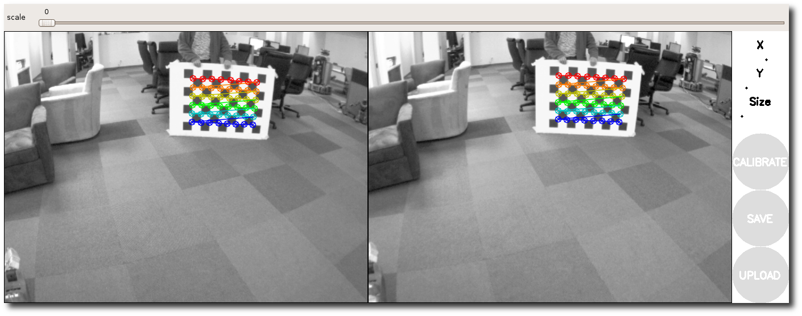

Dual Checkerboards
------------------

To use multiple checkerboards, give multiple ``--size`` and
```--square`` options for additional boards. Make sure the boards
have different dimensions, so the calibration system can tell
them apart.

Holding the Checkerboard
------------------------
Make sure that you hold the checkerboard horizontally (more
checkers horizontally than vertically).

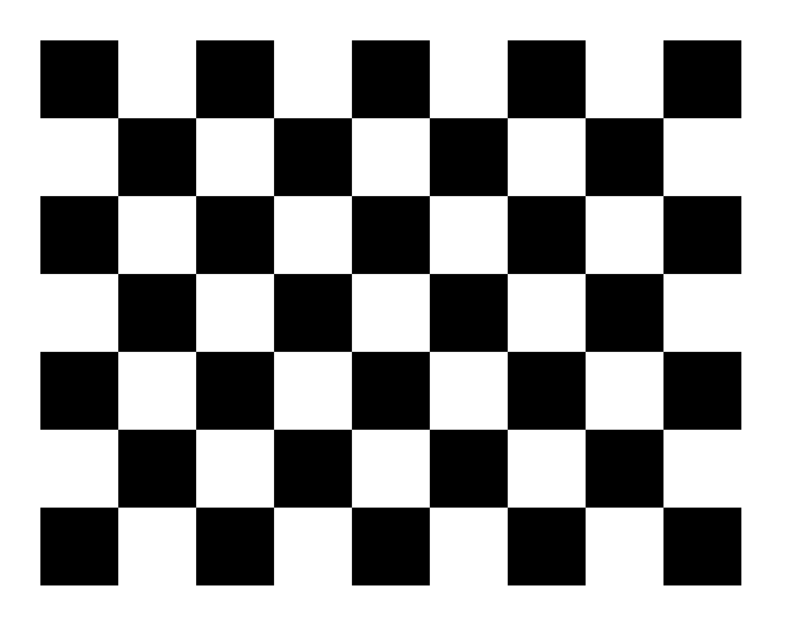

Moving the Checkerboard
-----------------------
In order to get a good calibration you will need to move the
checkerboard around in the camera frame such that:

 * The checkerboard is detected at the left and right edges
   of the field of view (X calibration).
 * The checkerboard is detected at the top and bottom edges
   of the field of view (Y calibration).
 * The checkerboard is detected at various angles to the
   camera ("Skew").
 * The checkerboard fills the entire field of view
   (Size calibration).
 * checkerboard tilted to the left, right, top and bottom
   (X,Y, and Size calibration).


|cal0007| |cal0009| |cal0011|

|cal0006| |cal0008| |cal0012|

.. |cal0007| image:: images/cal0007.png
   :width: 32%

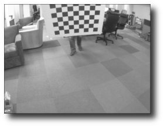

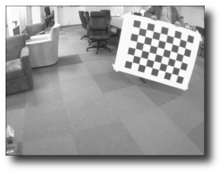

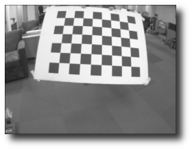

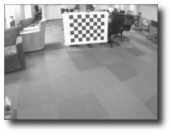

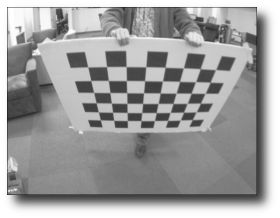

As you move the checkerboard around you will see three bars on the
calibration sidebar increase in length. When the **CALIBRATE** button
lights, you have enough data for calibration and can click **CALIBRATE**
to see the results.

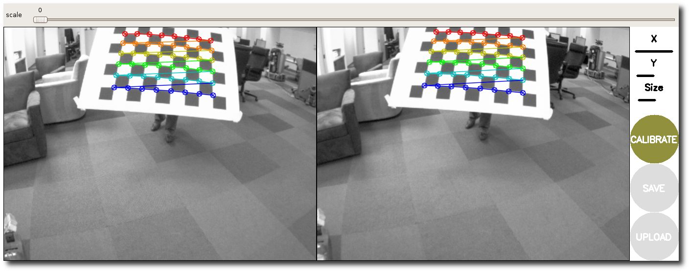

Calibration Results
-------------------
After the calibration is complete you will see the calibration results
in the terminal and the calibrated image in the calibration window:

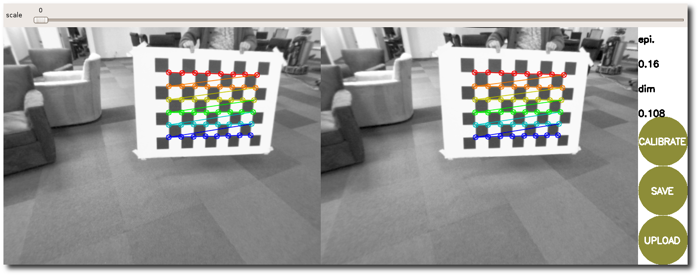

The sidebar will show the measured accuracy and dimensions of the
checkerboard square, in the above case the checkerboard square was
111mm with an accuracy of 0.31 pixels.

A successful calibration will result in real-world straight edges
appearing straight in the corrected image.

A failed calibration usually results in blank or unrecognizable images,
or images that do not preserve straight edges.

Typically, an epipolar error below 0.25 pixel is considered acceptable,
and below 0.1 excellent.

You can also use the slider at the top of the calibration window to
change the size of the rectified image, as shown below. A scale of 0.0
means that the image is sized so that all pixels in the rectified image
are valid. The rectified image has no border, but some pixels from the
original image are discarded. A scale of 1.0 means that all pixels in
the original image are visible, but the rectified image has black
borders where there are no input pixels in the original image.

The recommended value for the slider is 0.0.

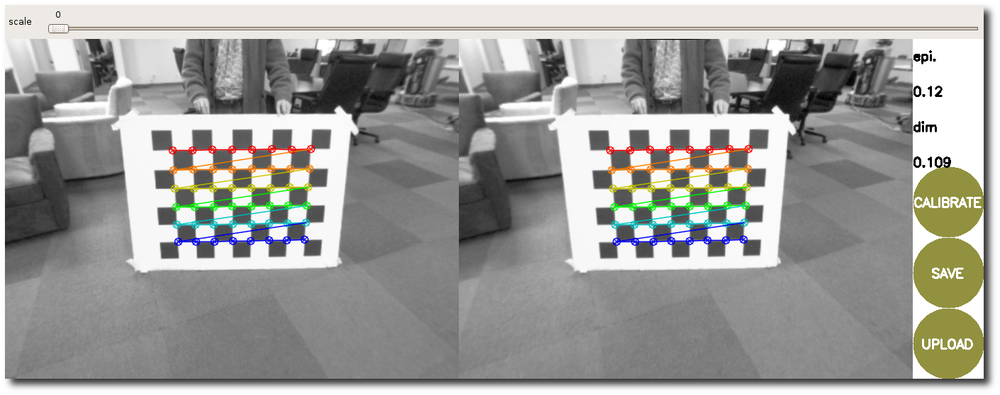

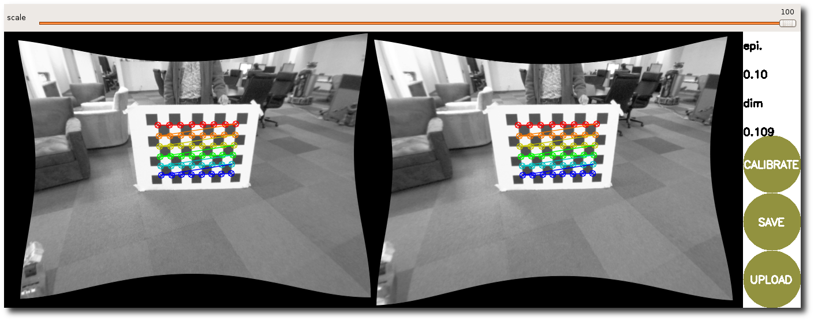

For more details on the stereo camera model - including interpretation
of these results - see
`OpenCV <https://docs.opencv.org/4.5.4/d9/d0c/group__calib3d.html>`_
and image_geometry.

.. code-block:: bash

    Left:
    D =  [-0.31420196940339423, 0.091934927292188981, 0.0012952332628749881, -0.0016196264582460102]
    K =  [425.19601412158482, 0.0, 308.29689772295882, 0.0, 426.02702697756899, 223.53789948448997, 0.0, 0.0, 1.0]
    R =  [0.99783514664821127, 0.013543024537547797, 0.064355315242164368, -0.013644479706482148, 0.99990626305523833, 0.0011372231303031885, -0.064333881330776027, -0.0020128560018237928, 0.99792640015365552]
    P =  [308.02438413775218, 0.0, 270.8484992980957, 0.0, 0.0, 308.02438413775218, 226.91282844543457, 0.0, 0.0, 0.0, 1.0, 0.0]

    Right:
    D =  [-0.30550530964404188, 0.082701072309439266, 0.001966752019596593, -0.0016409796174513081]
    K =  [425.18741896821433, 0.0, 323.8787136811938, 0.0, 426.46867413824884, 226.19589833365407, 0.0, 0.0, 1.0]
    R =  [0.99769116642055589, 0.011418153515469445, 0.066947458627553177, -0.011312576360776634, 0.99993409783500409, -0.0019559148698406695, -0.066965379581335679, 0.0011940507500265176, 0.99775458514623427]
    P =  [308.02438413775218, 0.0, 270.8484992980957, -28.144333365644293, 0.0, 308.02438413775218, 226.91282844543457, 0.0, 0.0, 0.0, 1.0, 0.0]

    # oST version 5.0 parameters

    [image]

    width
    640

    height
    480

    [narrow_stereo/left]

    camera matrix
    425.196014 0.000000 308.296898
    0.000000 426.027027 223.537899
    0.000000 0.000000 1.000000

    distortion
    -0.314202 0.091935 0.001295 -0.001620 0.0000

    rectification
    0.997835 0.013543 0.064355
    -0.013644 0.999906 0.001137
    -0.064334 -0.002013 0.997926

    projection
    308.024384 0.000000 270.848499 0.000000
    0.000000 308.024384 226.912828 0.000000
    0.000000 0.000000 1.000000 0.000000

    # oST version 5.0 parameters

    [image]

    width
    640

    height
    480

    [narrow_stereo/right]

    camera matrix
    425.187419 0.000000 323.878714
    0.000000 426.468674 226.195898
    0.000000 0.000000 1.000000

    distortion
    -0.305505 0.082701 0.001967 -0.001641 0.0000

    rectification
    0.997691 0.011418 0.066947
    -0.011313 0.999934 -0.001956
    -0.066965 0.001194 0.997755

    projection
    308.024384 0.000000 270.848499 -28.144333
    0.000000 308.024384 226.912828 0.000000
    0.000000 0.000000 1.000000 0.000000

If you are satisfied with the calibration, click **COMMIT** (on the pictures
above this is button has an old name **UPLOAD**) to send the calibration
parameters to the camera for permanent storage.

If you want to save the calibration parameters and images used in calibration,
click **SAVE**. Everything will be made available in the compressed folder
``/tmp/calibrationdata.tar.gz``.
