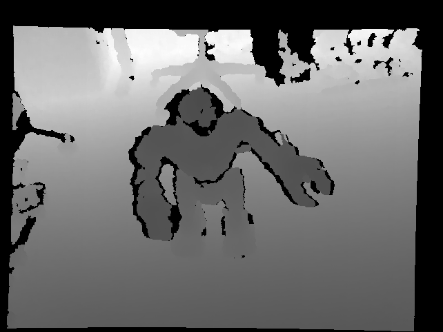

Nodes and Components
====================

This package includes a number of ROS 2 components that can be assembled
into depth image processing pipelines.
See the tutorial :ref:`Launch depth_image_proc Components`.

Alternatively, each component can be run as a standalone node.

depth_image_proc::ConvertMetricNode
-----------------------------------
Component to convert raw uint16 depth image in millimeters to
float depth image in meters.
Also available as a standalone node with the name ``convert_metric_node``.

Subscribed Topics
^^^^^^^^^^^^^^^^^
 * **image_raw** (sensor_msgs/Image): ``uint16`` depth image in millimeters,
   the native OpenNI format.

Published Topics
^^^^^^^^^^^^^^^^
 * **image** (sensor_msgs/Image): ``float`` depth image in meters, the
   recommended format for processing in ROS 2.

Parameters
^^^^^^^^^^
 * **image_transport** (string, default: raw): Image transport to use.

depth_image_proc::CropForemostNode
----------------------------------
Takes a depth image and crops the closest element. The node will find the
minimum depth value in the image and then set all pixels farther than
``min + distance`` to 0. Also available as a standalone node
``crop_foremost_node``.

Subscribed Topics
^^^^^^^^^^^^^^^^^
 * **image_raw** (sensor_msgs/Image): Must be a depth (single channel) image.

Published Topics
^^^^^^^^^^^^^^^^
 * **image** (sensor_msgs/Image): Cropped image.

Parameters
^^^^^^^^^^
 * **distance** (float, default: 0.0): The depth tolerance to use when
   thresholding the image. Pixels farther than ``min + distance`` will be
   set to 0.
 * **image_transport** (string, default: raw): Image transport to use.

depth_image_proc::DisparityNode
-------------------------------
Converts a depth image to disparity image. Also available as a standalone
node ``disparity_node``.
The images below show the raw depth image, and the output disparity image.
The output disparity image is being colorized using the ``disparity_view``
node from the ``image_view`` package.

|depth| |disparity|

Subscribed Topics
^^^^^^^^^^^^^^^^^
 * **left/image_rect** (sensor_msgs/Image): Rectified depth image.
 * **right/camera_info** (sensor_msgs/CameraInfo): Camera calibration and
   metadata. Must contain the baseline, which conventionally is encoded in
   the right camera P matrix.

Published Topics
^^^^^^^^^^^^^^^^
 * **left/disparity** (stereo_msgs/DisparityImage): Disparity image
   (inversely related to depth), for interop with stereo processing nodes.
   For all other purposes use depth images instead.

Parameters
^^^^^^^^^^
 * **delta_d** (double, default: 0.125): Smallest allowed disparity increment,
   which relates to the achievable depth range resolution. Defaults to 1/8 pixel.
 * **image_transport** (string, default: raw): Image transport to use.
 * **min_range** (double, default: 0.0): Minimum detectable distance.
 * **max_range** (double, default: +Inf): Maximum detectable distance.
 * **queue_size** (int, default: 5): Size of message queue for synchronizing
   subscribed topics.

depth_image_proc::PointCloudXyzNode
-----------------------------------
Converts a depth image to XYZ point cloud. Also available as a standalone
node ``point_cloud_xyz_node``.
The images below show the raw depth image, and the output point cloud,
colorized along the Z-axis.

|depth| |cloud_xyz|

Subscribed Topics
^^^^^^^^^^^^^^^^^
 * **image_rect** (sensor_msgs/Image): Rectified depth image.
 * **camera_info** (sensor_msgs/CameraInfo): Camera calibration and metadata.

Published Topics
^^^^^^^^^^^^^^^^
 * **points** (sensor_msgs/PointCloud2): XYZ point cloud. If using PCL,
   subscribe as PointCloud<PointXYZ>.

Parameters
^^^^^^^^^^
 * **depth_image_transport** (string, default: raw): Image transport to use
   for the depth topic subscriber.
 * **queue_size** (int, default: 5): Size of message queue for synchronizing
   subscribed topics.
 * **invalid_depth** (double, default: 0.0): Value used for replacing invalid depth
   values (if 0.0 the parameter has no effect).

depth_image_proc::PointCloudXyzRadialNode
-----------------------------------------
Converts a radial depth image to an XYZ point cloud. Note that radial nodes
assume an unrectified radial image, and therefore use the K and D matrices
of the camera info message, rather than the P matrix. Also available as a
standalone node ``point_cloud_xyz_radial_node``.

Subscribed Topics
^^^^^^^^^^^^^^^^^
 * **depth/image_raw** (sensor_msgs/Image): Unrectified radial depth image.
 * **depth/camera_info** (sensor_msgs/CameraInfo): Camera calibration and metadata.

Published Topics
^^^^^^^^^^^^^^^^
 * **points** (sensor_msgs/PointCloud2): XYZ point cloud. If using PCL,
   subscribe as PointCloud<PointXYZ>.

Parameters
^^^^^^^^^^
 * **depth_image_transport** (string, default: raw): Image transport to use
   for the depth topic subscriber.
 * **queue_size** (int, default: 5): Size of message queue for synchronizing
   subscribed topics.

depth_image_proc::PointCloudXyziNode
------------------------------------
Component to convert depth image to XYZI point cloud. Also available as a
standalone node ``point_cloud_xyzi_node``.

Subscribed Topics
^^^^^^^^^^^^^^^^^
 * **depth/image_rect** (sensor_msgs/Image): Rectified depth image.
 * **intensity/image_rect** (sensor_msgs/Image): Rectified intensity image.
 * **intensity/camera_info** (sensor_msgs/CameraInfo): Camera calibration and metadata.

Published Topics
^^^^^^^^^^^^^^^^
 * **points** (sensor_msgs/PointCloud2): XYZ point cloud. If using PCL,
   subscribe as PointCloud<PointXYZI>.

Parameters
^^^^^^^^^^
 * **depth_image_transport** (string, default: raw): Image transport to use
   for the depth topic subscriber.
 * **image_transport** (string, default: raw): Image transport to use for
   the intensity image subscriber.
 * **queue_size** (int, default: 5): Size of message queue for synchronizing
   subscribed topics.
 * **invalid_depth** (double, default: 0.0): Value used for replacing invalid depth
   values (if 0.0 the parameter has no effect).

depth_image_proc::PointCloudXyziRadialNode
------------------------------------------
Converts a radial depth image and an intensity image to an XYZI point cloud.
Note that radial nodes assume an unrectified radial image, and therefore
use the K and D matrices of the camera info message, rather than the P matrix.
Also available as a standalone node ``point_cloud_xyzi_radial_node``.

Subscribed Topics
^^^^^^^^^^^^^^^^^
 * **depth/image_raw** (sensor_msgs/Image): Unrectified radial depth image.
 * **intensity/image_raw** (sensor_msgs/Image): Unrectified intensity image.
 * **intensity/camera_info** (sensor_msgs/CameraInfo): Camera calibration and metadata.

Published Topics
^^^^^^^^^^^^^^^^
 * **points** (sensor_msgs/PointCloud2): XYZI point cloud. If using PCL,
   subscribe as PointCloud<PointXYZI>.

Parameters
^^^^^^^^^^
 * **depth_image_transport** (string, default: raw): Image transport to use
   for the depth topic subscriber.
 * **image_transport** (string, default: raw): Image transport to use for
   the intensity image subscriber.
 * **queue_size** (int, default: 5): Size of message queue for synchronizing
   subscribed topics.

depth_image_proc::PointCloudXyzrgbNode
--------------------------------------
Combines a registered depth image and an RGB image into XYZRGB point cloud.
Also available as a standalone node ``point_cloud_xyzrgb_node``.

|depth_reg| |rgb|

The node can convert the registered depth and rgb images (above) into a colorized
point cloud (below):

|cloud_xyzrgb|

Subscribed Topics
^^^^^^^^^^^^^^^^^
 * **depth_registered/image_rect** (sensor_msgs/Image): Rectified depth image,
   registered to the RGB camera
 * **rgb/image_rect_color** (sensor_msgs/Image): Rectified color image.
 * **rgb/camera_info** (sensor_msgs/CameraInfo): RGB camera calibration and metadata.

Published Topics
^^^^^^^^^^^^^^^^
 * **points** (sensor_msgs/PointCloud2): XYZ point cloud. If using PCL,
   subscribe as PointCloud<PointXYZRGB>.

Parameters
^^^^^^^^^^
 * **depth_image_transport** (string, default: raw): Image transport to use
   for depth_registered subscriber.
 * **image_transport** (string, default: raw): Image transport to use for
   rgb/image_rect_color subscriber.
 * **exact_sync** (bool, default: False): Whether to use exact synchronizer.
 * **queue_size** (int, default: 5): Size of message queue for synchronizing
   subscribed topics.
 * **invalid_depth** (double, default: 0.0): Value used for replacing invalid depth
   values (if 0.0 the parameter has no effect).

depth_image_proc::PointCloudXyzrgbRadialNode
--------------------------------------------
Converts a radial depth image and an rgb image to an XYZRGB point cloud.
Note that radial nodes assume an unrectified radial image, and therefore
use the K and D matrices of the camera info message, rather than the P matrix.
Also available as a standalone node ``point_cloud_xyzrgb_radial_node``.

Subscribed Topics
^^^^^^^^^^^^^^^^^
 * **depth/image_raw** (sensor_msgs/Image): Unrectified radial depth image.
 * **rgb/image_raw** (sensor_msgs/Image): Unrectified rgb image.
 * **rgb/camera_info** (sensor_msgs/CameraInfo): Camera calibration and metadata.

Published Topics
^^^^^^^^^^^^^^^^
 * **points** (sensor_msgs/PointCloud2): XYZRGB point cloud. If using PCL,
   subscribe as PointCloud<PointXYZRGB>.

Parameters
^^^^^^^^^^
 * **depth_image_transport** (string, default: raw): Image transport to use
   for the depth topic subscriber.
 * **image_transport** (string, default: raw): Image transport to use for
   the rgb image subscriber.
 * **queue_size** (int, default: 5): Size of message queue for synchronizing
   subscribed topics.

depth_image_proc::RegisterNode
------------------------------
Component to "register" a depth image to another camera frame. Reprojecting the
depths requires the calibration parameters of both cameras and, from tf, and the
extrinsic transform between them. The images below show the depth image before
and after apply registration:

|depth| |depth_reg|

Subscribed Topics
^^^^^^^^^^^^^^^^^
 * **depth/image_rect** (sensor_msgs/Image): Rectified depth image. The image should
   be either 16UC1 (which is interpreted as millimeters) or 32FC1 (which is interpreted
   as meters).
 * **depth/camera_info** (sensor_msgs/CameraInfo): Depth camera calibration and metadata.
 * **rgb/camera_info** (sensor_msgs/CameraInfo): RGB camera calibration and metadata.

Published Topics
^^^^^^^^^^^^^^^^
 * **depth_registered/camera_info** (sensor_msgs/CameraInfo): Camera calibration and
   metadata. Same as rgb/camera_info but time-synced to depth_registered/image_rect.
 * **depth_registered/image_rect** (sensor_msgs/Image): Reprojected depth image in the
   RGB camera frame.

Parameters
^^^^^^^^^^
 * **depth_image_transport** (string, default: raw): Image transport to use
   for depth subscriber.
 * **use_rgb_timestamp** (bool, default: false) : use timestamp of rgb image instead of depth image for the registered image.
 * **fill_upsampling_holes** (bool, default: false) : when RGB is higher res, interpolate by rasterizing depth triangles onto the registered image.
 * **queue_size** (int, default: 5): Size of message queue for synchronizing
   subscribed topics.

Required TF Transforms
^^^^^^^^^^^^^^^^^^^^^^
 * /depth_optical_frame → /rgb_optical_frame: The transform between the depth and
   RGB camera optical frames as specified in the headers of the subscribed topics
   (rendered here as /depth_optical_frame and /rgb_optical_frame).
