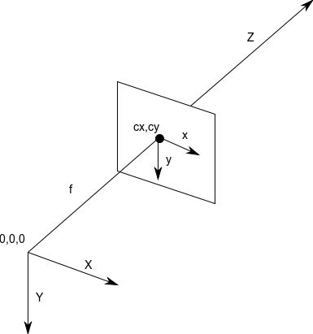
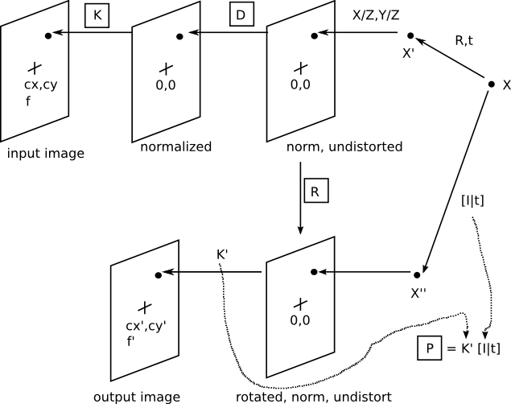

.. _Camera Info:

Camera Info
===========

Camera Coordinate System
------------------------
Below is a diagram of the camera coordinate system assumed by the
CameraInfo message. It is a right-handed system, with the world X
and Y aligned with the image x and y. This is the same coordinate
system used in OpenCV. It differs from the coordinate system of
Harley and Zisserman, which has Z forward, Y up, and X to the
left (looking towards +Z).

|coords|

Derivation Diagram
------------------

Below is a diagram of the various images that are conceptually
derivable from the CameraInfo message. The boxed variables are
present in this message.

|camera_info|

Projection Onto the Original Image
----------------------------------
Starting with an initial 3D point X, the position of the corresponding
image point is found by going right-to-left in the upper half of the
diagram. The process is summarized by the following equations.

.. code-block:: text

    X' = [R,t]X   transform
    sx = X'       projection
    x* = d(x)     distortion
    q  = Kx*      pixel coordinates

This process uses the K camera matrix and D distortion vector from CameraInfo.
Ignoring the transform T, you can find the projection of a point X' into the
original camera frame using these equations. First, the 3D point X' is
projected onto the normalized, undistorted image via a projection operation
(division by Z). Then the distortion coefficients are used in the function
d() to move the point to its distorted position, still in a normalized image.
Finally, the normalized image is converted to a pixel-coordinate image by
applying the camera matrix to each image point.

Rectification
-------------
Rectification is the process of transforming the input image into an output
image with the distortion corrected, and optionally the normalized image plane
transformed by rotation, optinain-image-plane translation, and optionally
in-image-plane scale.

Simple Monocular Rectification
------------------------------
In this case, there is a monocular device with distortion correction only.
To transform a pixel in the input image into one in the output image, it is
sent through the K - D - R - K' series of transformations. K - D gets to the
normalized, undistorted image; the rotation R is the identity because we
don't want to rotate the normalized undistorted image; and then K' converts
back to pixel coordinates in the output image. In this case, since there is
no need of in-image-plane translation, or scaling from the original image,
so K = K' , and only the K and D elements of CameraInfo are needed.
The ``camera_calibration`` package does monocular calibration to get K'
using OpenCV's getOptimalNewCameraMatrix() function with argument
'alpha'=0.0 that cause K' ≠ K.

Projection onto the output image is by the P matrix, which is formed from K'
and the optional rotation and translation, in this case the identity and 0,
respectively. So if K' = K, P is redundant information, and could be formed
directly from K.

Stereo and Complex Monocular Rectification
------------------------------------------
After getting normalized undistorted image using K and D, here we apply a
transformation to the normalized, undistorted image: each points on this
image is rotated by R and then is passed to K' get the correspondent pixel
coordinate on the output image which is translated and scaled by K' with
respect to the original image. This transformation is important, for example,
in aligning two images of a stereo pair to lie in the same plane and have
coincident epipolar lines.

The transform of a pixel from the input to output image is the same as in
the simple monocular case, except that R need not be the identity, and K'
need not be equal to K. As a consequence, the normalized undistorted image
can be rotated in 3D space, and the output image can be translated, scaled
relative to the original image.

The projection matrix has an additional parameter, a translational offset t.
This parameter is used in the right stereo camera to reflect its external
position relative to the left camera. Since the point X in left camera
frame is transformed to the right camera by [I|t], that means the position
of the left camera frame origin with respect to the right camera frame is
given by the vector t in the right camera frame.

Putting this all together, the projection matrix for the rectified output
image is given by:

.. code-block:: text

    P = K' [I|t].

Note that in this case the internal camera parameters of the output image,
K', can be different from the input image, so P cannot be formed just
from K and D. And the I is the 3x3 rotation matrix representing left
camera frame in the right, not the identity.
