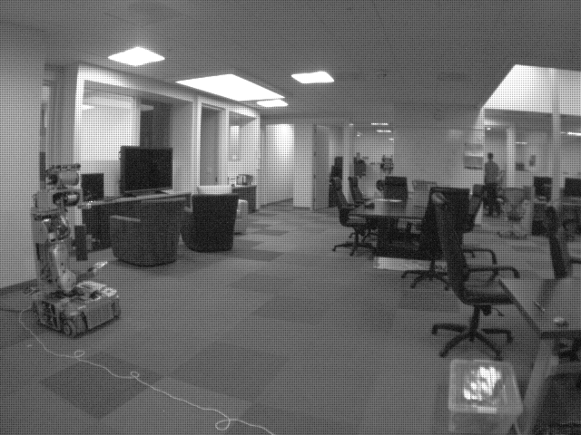
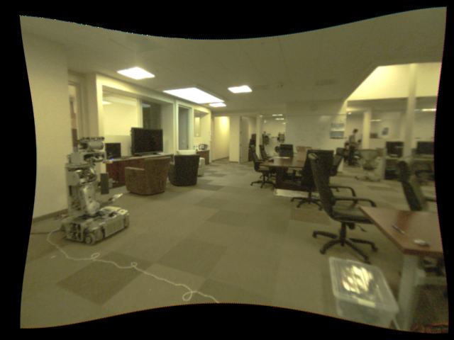

Overview
========

This package contains a number of ROS 2 components and nodes for image processing.

An example of what ``image_proc`` components can do is taking an original
camera image, which is Bayered and distorted, and transforming it into a
rectified image, de-Bayered and undistorted (amount of black border may
vary depending on calibration):

|raw| |color|

The images above were produced using the tutorial :ref:`Using image_proc Launch File`.

.. toctree::
   :maxdepth: 2

   self
   components
   tutorials
   image_proc <generated/index>

Indices and tables
==================

* :ref:`genindex`
* :ref:`search`
