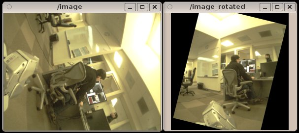

Overview
========

This package contains a node that rotates an image stream in a way that
minimizes the angle between a vector in some arbitrary frame and a vector
in the camera frame. The frame of the outgoing image is published by the
node.

This node is intended to allow camera images to be visualized in an
orientation that is more intuitive than the hardware-constrained
orientation of the physical camera. This is particularly helpful,
for example, to show images from the PR2's forearm cameras with a
consistent up direction, despite the fact that the forearms need to
rotate in arbitrary ways during manipulation.

It is not recommended to use the output from this node for further
computation, as it interpolates the source image, introduces black
borders, and does not output a ``camera_info``.

|image_rotate|

.. toctree::
   :maxdepth: 2

   self
   components
   image_rotate <generated/index>

Indices and tables
==================

* :ref:`genindex`
* :ref:`search`
