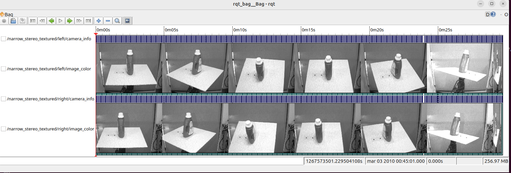
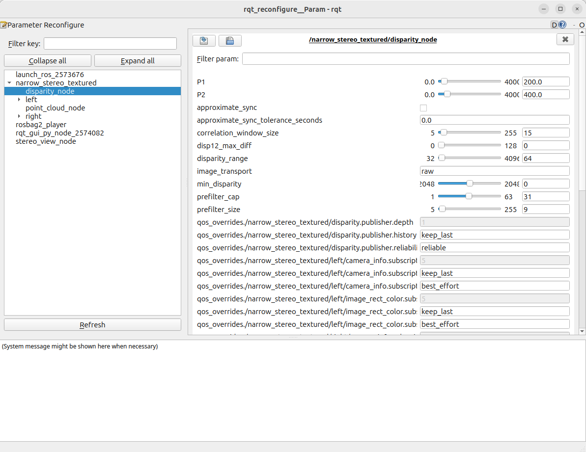
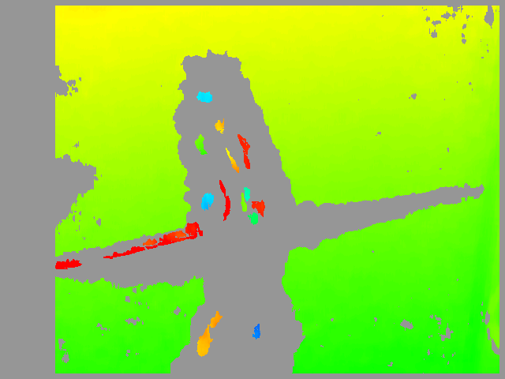
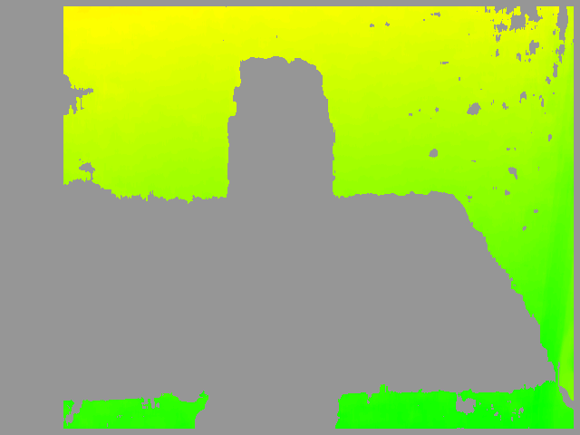
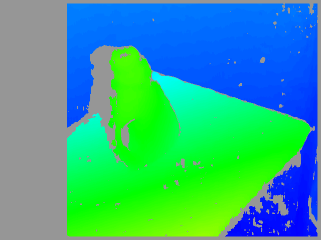
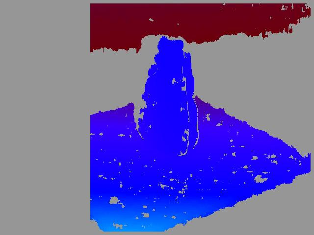
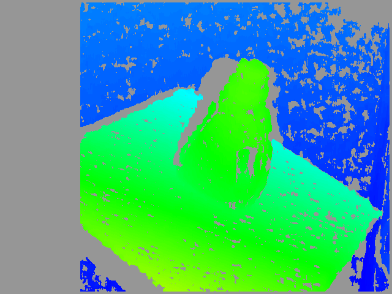

.. _choosing_good_stereo_parameters:

Choosing Good Stereo Parameters
===============================

.. contents:: Table of Contents
   :local:
   :depth: 2

Overview
--------

The ``stereo_image_proc.launch.py`` launch file provides a complete example for stereo image processing.
It performs rectification and de-mosaicing of raw stereo camera image pairs.
It also generates disparity images and point clouds.

Preliminaries
-------------

We will use the stereo camera data recorded in [TODO] for this tutorial.
First, we need to identify the stereo namespace by checking what topics are available in the bag.

.. code-block:: bash

   $ ros2 bag info rotating_detergent_1_6

   Files:             rotating_detergent_1_6_qos__tmp.db3
   Bag size:          257.0 MiB
   Storage id:        sqlite3
   ROS Distro:        rosbags
   Duration:          29.721329000s
   Start:             Mar  3 2010 00:45:01.229504000 (1267573501.229504000)
   End:               Mar  3 2010 00:45:30.950833000 (1267573530.950833000)
   Messages:          1748
   Topic information: Topic: /narrow_stereo_textured/left/camera_info | Type: sensor_msgs/msg/CameraInfo | Count: 437 | Serialization Format: cdr
                      Topic: /narrow_stereo_textured/left/image_color | Type: sensor_msgs/msg/Image | Count: 437 | Serialization Format: cdr
                      Topic: /narrow_stereo_textured/right/camera_info | Type: sensor_msgs/msg/CameraInfo | Count: 437 | Serialization Format: cdr
                      Topic: /narrow_stereo_textured/right/image_color | Type: sensor_msgs/msg/Image | Count: 437 | Serialization Format: cdr
   Services:          0
   Service information:
   Actions:           0
   Action information:

Alternatively, you can use the ``rqt_bag`` GUI tool for a visual exploration:

.. code-block:: bash

   $ rqt_bag rotating_detergent_1_6.bag

For this example, our stereo namespace is ``narrow_stereo_textured``.
This particular bag contains images of a detergent bottle rotating on a pan-tilt table.
The data comes from the narrow stereo camera on a PR2 robot with the textured light projector enabled.
The projector adds texture to the scene, which helps stereo correlation.
Without this artificial texture, stereo correlation would fail on blank regions like walls and tabletops.

Start the stereo processing node
--------------------------------

Launch ``stereo_image_proc`` in the ``narrow_stereo_textured`` namespace.
It will automatically connect to the camera topics:

.. code-block:: bash

   ros2 launch stereo_image_proc stereo_image_proc.launch.py namespace:=narrow_stereo_textured

Now launch the dynamic reconfigure GUI to adjust parameters in real-time:

.. code-block:: bash

   ros2 run rqt_reconfigure rqt_reconfigure

In the drop-down menu, select ``/narrow_stereo_textured/disparity_node``. 

What do those parameters mean?
------------------------------

In the disparity image, color encodes distance.
Warmer colors (red) represent objects closer to the camera.
Cooler colors (blue) represent objects farther away.
Black pixels are *unmatched* regions where the matcher could not find a confident correspondence.
The goal of tuning is to achieve an image that is **dense** (few black holes on surfaces of interest) and **clean** (free of speckle noise and false matches) while preserving real detail.

Tuning the parameters
---------------------

Change one parameter at a time and observe the effect on the disparity image.
A recommended tuning order is: (1) pick the algorithm, (2) get the object inside the search range, (3) sharpen the window size, and (4) suppress noise.

**stereo_algorithm** *(0 = Block Matching, 1 = Semi-Global Block Matching)*
    Block Matching (BM) is fast and is the default algorithm.
    Semi-Global Block Matching (SGBM) is slower but produces denser, smoother results.
    SGBM performs especially well on weakly textured surfaces.
    Start with BM and switch to SGBM if BM leaves too many holes in the disparity image.

**disparity_range** *(default 64; multiple of 16)*
    This parameter defines the number of disparities searched by the matcher.
    Together with ``min_disparity``, it defines the *horopter* (visible depth range).
    Objects whose disparity falls outside this range appear as black pixels.
    Increase the range until your closest object of interest is matched.
    Wider ranges require more CPU, so use the smallest value that covers your scene.

**min_disparity** *(default 0)*
    This parameter sets the starting point for the disparity search.
    It effectively shifts the visible depth range nearer or farther from the camera.
    Raise it to bring very close objects (with large disparity) into range.
    Lower it (it can be negative) to focus on farther scenes.
    Always tune this parameter together with ``disparity_range``.

**correlation_window_size** *(default 15; odd, BM and SGBM)*
    This parameter controls the width of the Sum of Absolute Differences (SAD) matching window.
    Larger windows produce smoother, denser disparity maps but blur fine details and object edges.
    Smaller windows preserve detail but produce noisier results and leave more holes.
    Typical useful values are odd numbers ranging from 9 to 21.

**prefilter_size / prefilter_cap** *(BM)*
    Pre-filtering normalizes brightness and texture before matching.
    This makes the matcher robust to lighting differences between the two cameras.
    ``prefilter_cap`` (default 31) bounds the normalized pixel values.
    ``prefilter_size`` (default 9, odd) defines the normalization window size.
    The default values are usually adequate.
    Adjust ``prefilter_cap`` only if one image is significantly brighter than the other.

**uniqueness_ratio** *(default 15.0, BM and SGBM)*
    A match is accepted only if the best match is better than the second-best by this margin (in percent).
    Increasing this value removes ambiguous matches, reducing noise but decreasing density.
    Decreasing this value fills more pixels but admits more false matches.

**texture_threshold** *(default 10, BM only)*
    This parameter rejects matches in low-texture regions where the SAD response is too weak to be reliable.
    It filters out matches in blank walls, sky, and other featureless regions.
    Raise it to drop noisy matches on featureless surfaces.
    Lower it to keep more matches in weakly textured areas.

**speckle_size / speckle_range** *(default 100 / 4)*
    This is a post-filter that removes small, isolated "speckle" blobs of disparity.
    These blobs are typical mismatch noise that differs from surrounding disparities.
    ``speckle_size`` sets the largest blob size (in pixels) that will be removed.
    ``speckle_range`` controls how much disparity variation is tolerated within a blob.
    Increase ``speckle_size`` to remove more noise.
    If real thin structures are being erased, reduce ``speckle_size``.

Start bag playback
------------------

.. code-block:: bash

   ros2 bag play --loop ~/Downloads/rotating_detergent_1_6

This command plays the bag at one-tenth speed, giving you time to adjust parameters.
All running nodes are stateless with respect to time, so you can replay the bag as needed.
You should now see disparity data in your stereo visualization and/or RViz. 

Visualize the disparity and stereo images
-----------------------------------------

To view the disparity image, you can use ``stereo_view`` from the ``image_view`` package:

.. code-block:: bash

   ros2 run image_view stereo_view --ros-args -r stereo:=narrow_stereo_textured -r image:=image_rect_color

What's this junk on the tabletop?
---------------------------------

You should notice lots of little disparity blobs at apparently random depths where the table and detergent should be. 

Block-based matchers often produce "speckles" near object boundaries.
At boundaries, the matching window catches the foreground on one side and the background on the other.
In this scene, the matcher is also finding small spurious matches in the projected texture on the table.

To remove these artifacts, apply a speckle filter controlled by ``speckle_size`` and ``speckle_range``.
``speckle_size`` sets the threshold (in pixels) below which a disparity blob is dismissed as "speckle".
``speckle_range`` controls how close disparities must be to be considered part of the same blob.
In this scene, objects are relatively large, so we can increase ``speckle_size`` to 1000 pixels. 

But where are the table and object?
-----------------------------------

At this point, we have a nice depth gradient for the wall behind the pan-tilt table.
However, there is a gaping hole in the disparity image where the table and detergent should be.
What is causing this problem?

The table is too close to the camera for the stereo block matcher to detect it with the current settings.
This is due to how block matching works.
For each pixel in the left image, the matcher slides a window across a range of pixels in the corresponding row of the right image.
It searches for the most similar region.
The search range is determined by two parameters:

- ``disparity_range``: Controls how many pixels to slide the window over.
  A larger value expands the visible depth range but requires more computation.
- ``min_disparity``: Controls the offset from the left pixel's x-position where the search begins. 

The block matcher returns disparities in the range ``[min_disparity, min_disparity + disparity_range)``.
Since depth is inversely proportional to disparity, these parameters define the horopter (the 3D volume covered by the search).
Objects outside the horopter are invisible to the algorithm.

In this case, the disparity search range is ``[0, 64)``.
The table has disparities greater than 64, placing it outside the horopter.
Increasing ``disparity_range`` to 128 expands the horopter to include the table. 

Notice the blank area to the left of the detergent bottle.
This area is visible to the left camera but occluded by the bottle in the right camera.
The empty left margin of the disparity image has doubled in size, which is also related to ``disparity_range``.

``min_disparity`` is normally set to zero, allowing the block matcher to see out to infinity.
If your stereo cameras are verged (inclined towards each other), you may have negative disparities.
In this case, you could set ``min_disparity`` to a negative value.
If you want to detect objects very close to the camera (disparity > 128), set ``min_disparity`` to a positive value.
This shifts the horopter towards the camera, sacrificing far-field depth perception for near-field accuracy.

As an example, reduce ``disparity_range`` to 96 and incrementally increase ``min_disparity``.
Around ``min_disparity = 50``, you should see the table and detergent fade into view while the wall behind them fades out. 

Other parameters
----------------
The parameters below are less commonly adjusted.
However, they are documented for completeness:

``correlation_window_size`` controls the size of the sliding SAD (Sum of Absolute Differences) window.
This window is used to find matching points between the left and right images.
Larger window sizes smooth over small gaps in the disparity image but smear object boundaries.
The default value (15x15) is usually adequate.
For comparison, the disparity image below used ``correlation_window_size = 9`` and has more gaps: 

``uniqueness_ratio`` controls another post-filtering step.
If the best matching disparity is not sufficiently better than all other disparities in the search range, the pixel is filtered out.
Try tweaking this if ``texture_threshold`` and speckle filtering still allow spurious matches to pass through.

``prefilter_size`` and ``prefilter_cap`` control the pre-filtering phase.
This phase normalizes image brightness and enhances texture before block matching.
You typically do not need to adjust these parameters. 