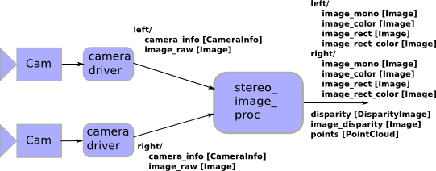
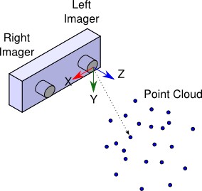

.. _Configuration:

Configuration
=============

Overview
--------

The ``stereo_image_proc.launch.py`` launch file provides a full example and
performs rectification and de-mosaicing of raw stereo camera image pairs.
It also perform stereo processing to generate disparity images and point clouds.

In topic names below, left and right are remapped using the ``left_namespace``
and ``right_namespace`` launch file parameters.

|stereo|

All processing is on demand. Color processing is performed only if there is a
subscriber to a color topic. Rectification is performed only if there is a
subscriber to a rectified topic. Disparities and point clouds are generated
only if there is a subscriber to a relevant topic. While there are no subscribers
to output topics, the nodes unsubscribe from the ``image_raw`` and
``camera_info`` topics.

Point clouds are generated in the optical frame of the left imager
(X Right, Y Down, Z out):

|stereo_frames|

Quick Start
-----------

Make sure your stereo camera driver(s) are running. You can check
``ros2 topic list | grep image_raw`` to see the available raw image
topics from compatible drivers.

To get rectified and/or colorized image streams, you need to launch the
``stereo_image_proc.launch.py`` launch file. If you are running on a
robot, it's probably best to run the launch file there. For example,
if your stereo camera driver(s) are publishing:

.. code-block::

    /stereo/left/image_raw
    /stereo/left/camera_info
    /stereo/right/image_raw
    /stereo/right/camera_info

you could do:

.. code-block:: bash

    ros2 launch stereo_image_proc stereo_image_proc.launch.py namespace:=stereo

Notice that we add the ``stereo`` namespace. Internally the launch file
also has a ``left_namespace`` and ``right_namespace`` which default to
``left`` and ``right``. Using this launch file is equivalent to Launching
two instances of the ``image_proc/image_proc.launch.py`` launch file in the
``stereo/left`` and ``stereo/right`` namespaces, with the addition of
the stereo outputs: disparity images (``stereo/disparity`` topic) and point
clouds (``stereo/points2`` topic)

In a separate terminal (on your home machine, if you are running on a robot):

.. code-block:: bash

    $ ros2 run image_view image_view image:=/stereo/left/image_rect_color

This will display a rectified color image from the left stereo camera.
Alternatively, stereo_view will show you both the left and right images
as well as a color-mapped disparity image:

.. code-block:: bash

    $ ros2 run image_view stereo_view stereo:=/stereo image:=image_rect_color

To view point clouds, you can use ``rviz2``.

Choosing Good Stereo Parameters
-------------------------------

There is an extensive tutorial on the
`ROS 1 wiki <http://wiki.ros.org/stereo_image_proc/Tutorials/ChoosingGoodStereoParameters>`,
however not all components exist in ROS 2 yet.
