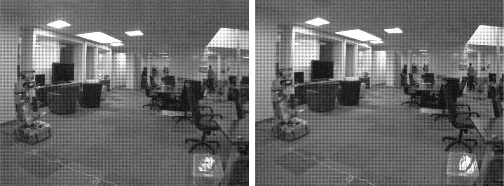
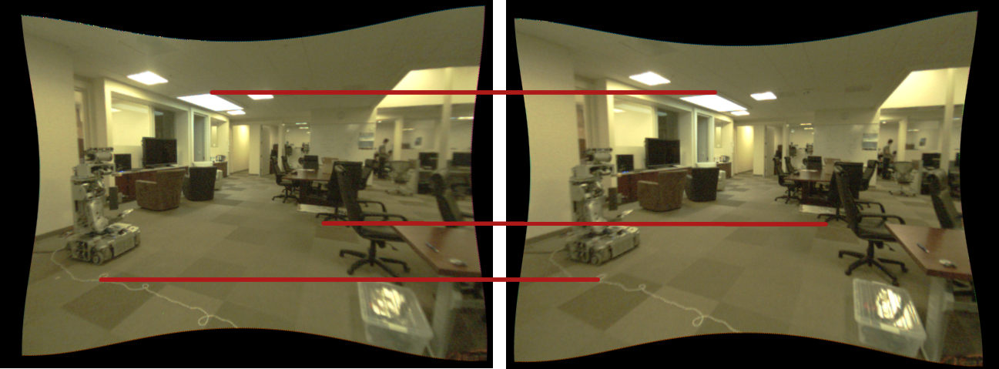
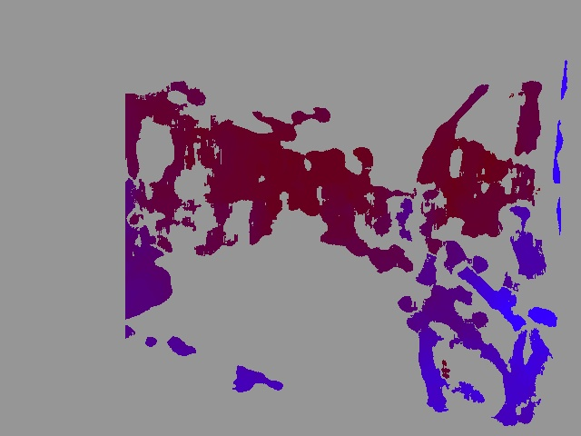

stereo_image_proc
=================

This package contains a number of ROS 2 components, nodes, and launch files
for stereo image processing.

stereo_image_proc performs the duties of image_proc for both cameras,
undistorting and colorizing the raw images. Note that for properly
calibrated stereo cameras, undistortion is actually combined with
rectification, transforming the images so that their scanlines
line up for fast stereo processing.

stereo_image_proc will also compute disparity images from incoming stereo
pairs using
`OpenCV's block matching <https://docs.opencv.org/2.4/modules/calib3d/doc/camera_calibration_and_3d_reconstruction.html#stereobm>`_
algorithm. These are best inspected
using ``stereo_view`` which is available in the ``image_view`` package.

The node will also produce point clouds, which you can view in ``rviz``,
and process with PCL.

The image below shows the **left/image_raw** and **right_image_raw**.
These are the raw images from each camera.

|raw|

Below are the **left/image_rect_color** and **right/image_rect_color**.
These are the rectified images from each camera.
The red lines show that the same point in the real world
lies on the same horizontal line in each rectified image.

|rectified|

The resulting disparity image is shown below,
viewed with ``stereo_view`` from the ``image_view`` package.

|disparity|

.. toctree::
   :maxdepth: 2

   components
   configuration
   tutorials
   changes
   stereo_image_proc <generated/index>

Indices and tables
==================

* :ref:`genindex`
* :ref:`search`
